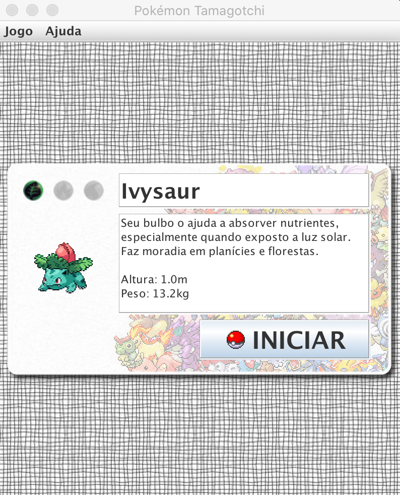
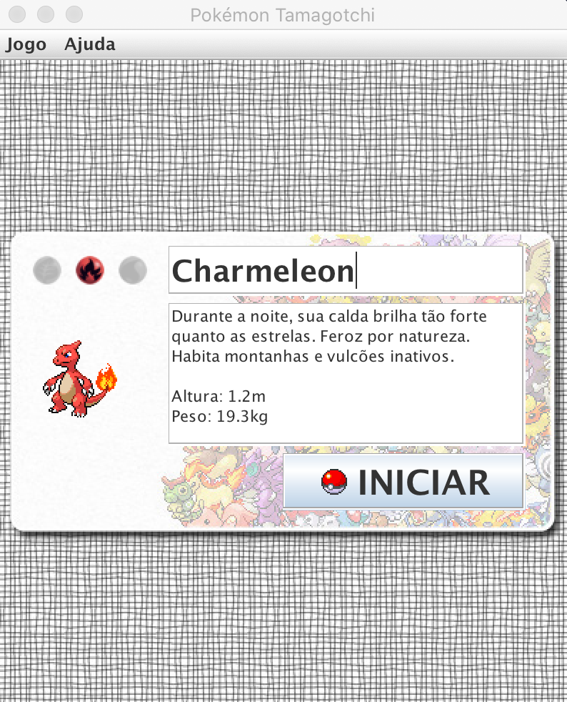
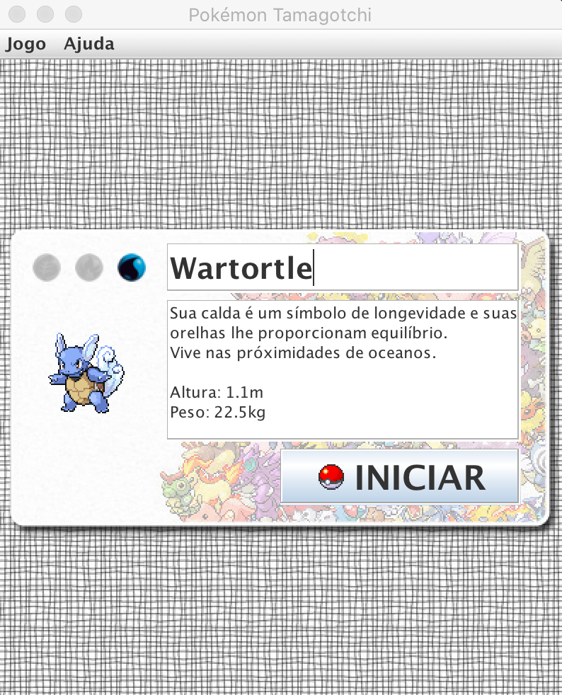
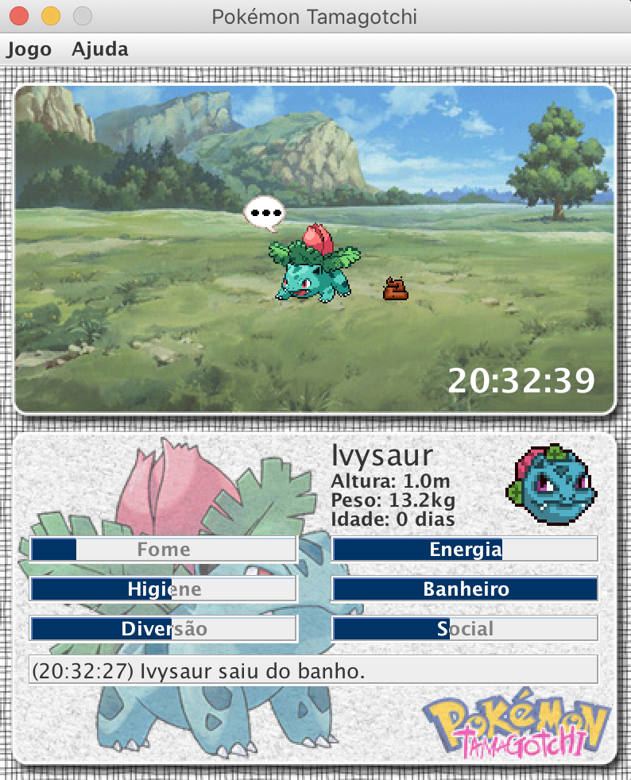
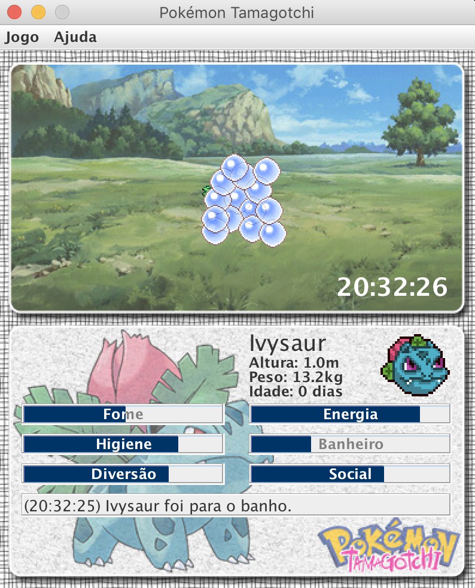
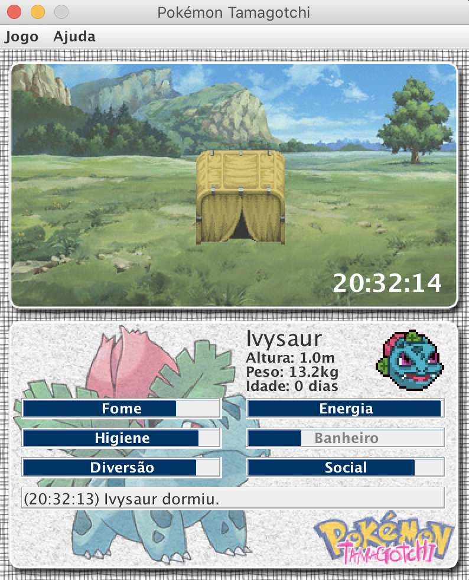
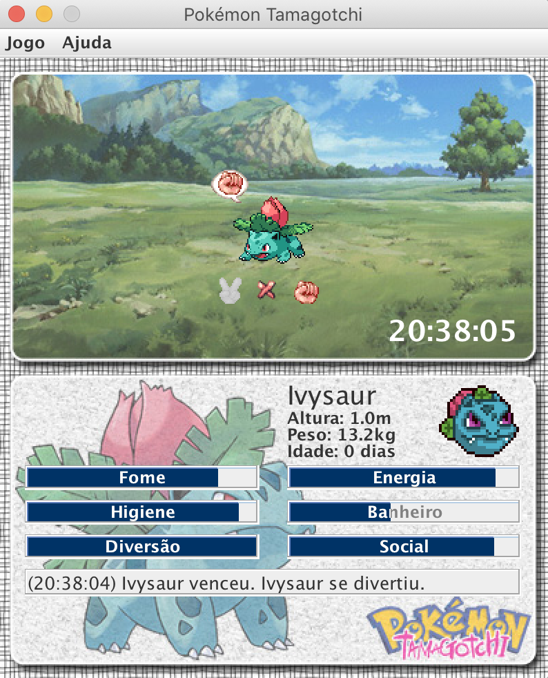
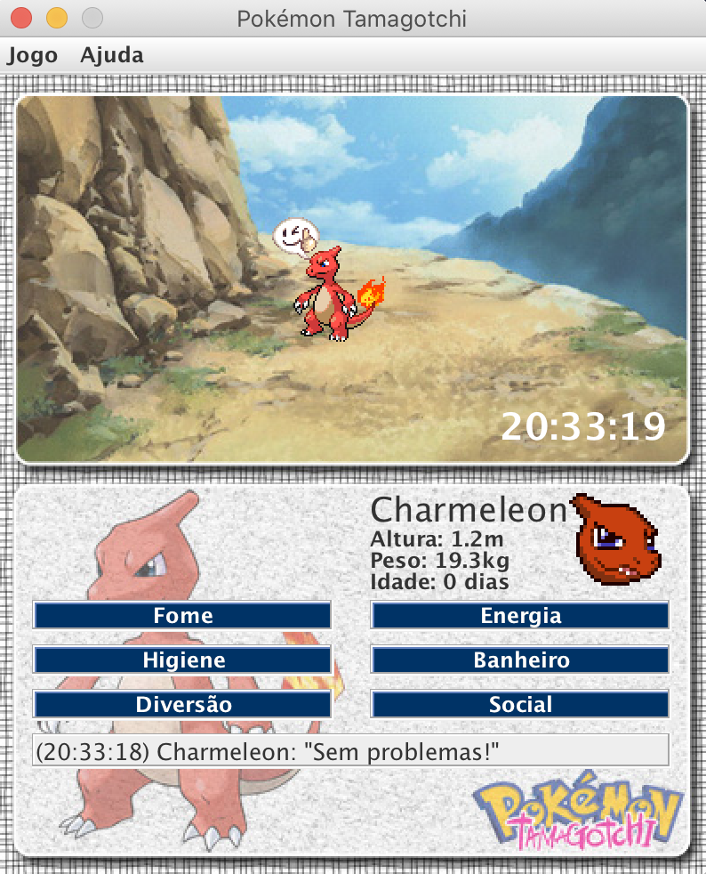
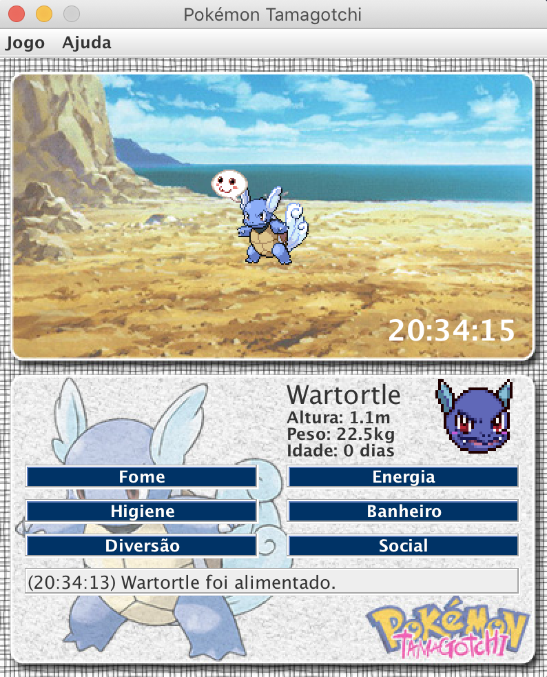

# pkmn-tmgt
Simple Pokémon Tamagotchi game written in Java.

## How to run

When you build an Java application project that has a main class, the IDE
automatically copies all of the JAR
files on the projects classpath to your projects dist/lib folder. The IDE
also adds each of the JAR files to the Class-Path element in the application
JAR files manifest file (MANIFEST.MF).

To run the project from the command line, go to the dist folder and
type the following:

`java -jar "pkmn-tmgt.jar"`

## Images

## License

2011 [MIT License](LICENSE).
